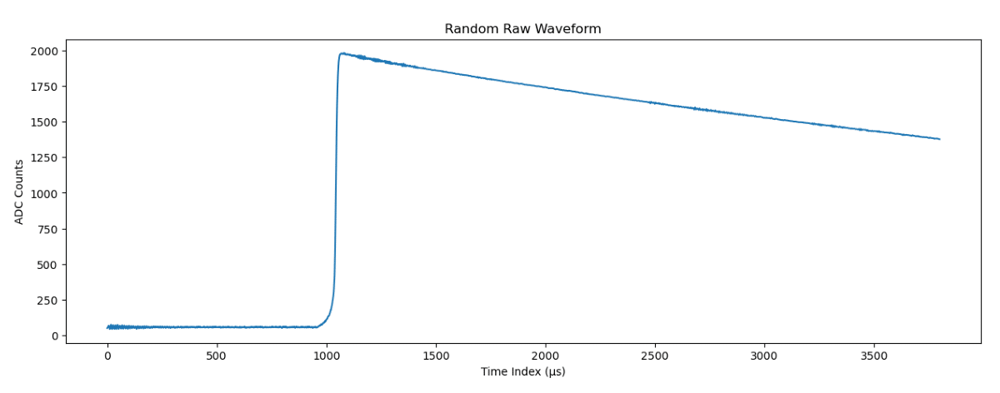

# Data

Our data consists of millions of waveforms from the germanium detector experiment like the following waveform:

Each waveform is a list of thousands of points corresponding to the energy detected at each microsecond in our experiment. Our data comes from an already carried out experiment that has separate files for Training, Testing, and NPML data. For the training and testing data, we're provided the waveforms along with a couple of parameters and the ground truth for our truedcr, low amplitude versus energy, high amplitude versus energy, and our late charge.
