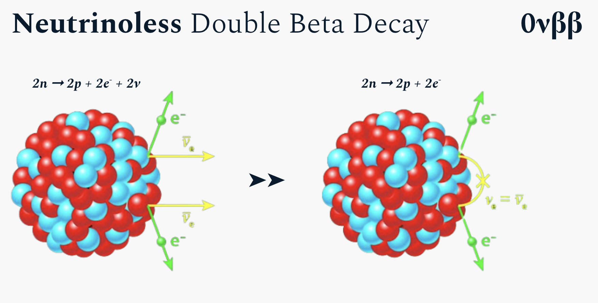
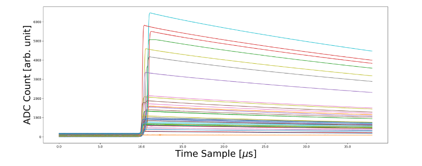
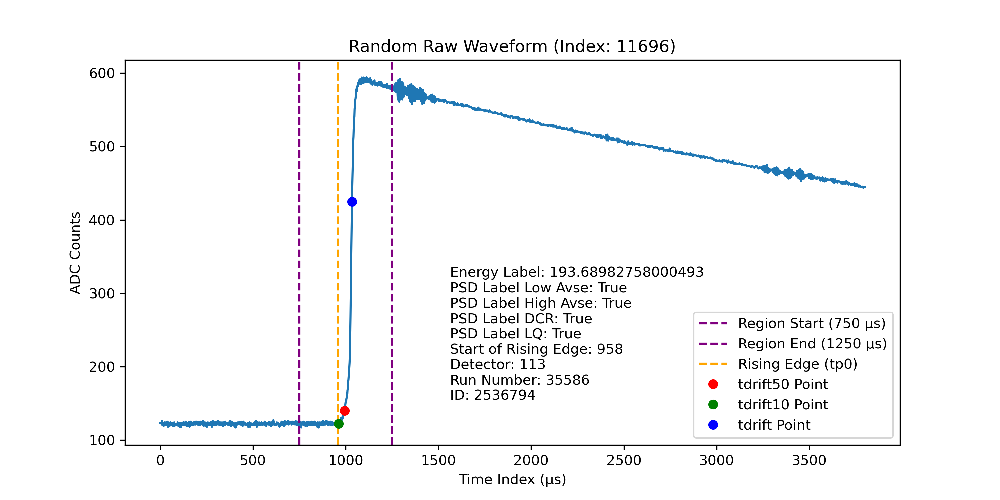

# Majorana Neutrino Hunt
{: .fs-9 }
Enhancing signal identification in the Majorana Demonstrator using machine learning.
{: .fs-6 .fw-300 }

[View it on GitHub][Our repo]{: .btn .btn-purple .fs-5 .mb-4 .mb-md-0 .mr-2 }

[Our report][Report]{: .btn .btn-primaruy .fs-5 .mb-4 .mb-md-0 }

{: .note }
> The purple button above links to our project repo, click [here][Website Repo] or the link at the top right corner of this page to see the repo for this website.

---

Our Applied Data Science project in NPML(Neutrino Physics Data Science) applies machine learning to analyze time-series data from the Majorana Demonstrator, extracting key features and developing models to distinguish signal events from background noise for improved event classification.

{: .important }
This website focuses on the classification subgroup of the NPML project. For details on regression, please visit the [regression group's website](https://zhtdbb1.github.io/FindingGhostParticles-Website/).

## Introduction

Our Applied Data Science project in NPML (Neutrino Physics Data Science) leverages machine learning to analyze time-series waveform data from the Majorana Demonstrator, aiming to detect energies related to neutrinoless double-beta decay. We focus on extracting key features and developing ML/DL models to enhance the precision of neutrino detection. This research could provide insights into the matter-antimatter asymmetry and the unique mass properties of neutrinos, although background interference poses challenges in signal identification.

### What is a Neutrino?

Neutrinos are extremely tiny, sub atomic particles. They don't have an electric charge and they are very difficult to probe. Because their mass is very less, they don't have much gravitational force acting upon them. Neutrinos are naturally produced through interactions in the unverse such as radioactive decay or nuclear reactions.

### Neutrinoless double beta decay

Neutrinoless double beta decay is a rare nuclear process where two neutrons convert into two protons and emit only electrons, implying that neutrinos are their own antiparticles and that lepton number is violated. Detecting this decay would revolutionize our understanding of particle physics by confirming the Majorana nature of neutrinos, providing critical insights into their tiny masses, and potentially revealing new physics beyond the Standard Model, insights that could help explain why our universe is dominated by matter over antimatter.
n, supernovae explosions, radioactive decays, cosmic rays, etc. 
<center></center>

<br>

### What do we want to do?

We aim to enhance the identification of signal events by developing and refining machine learning models that accurately distinguish between potential indicators of neutrinoless double beta decay and background noise. We strive to optimize feature extraction from time-series waveform data to capture the subtle patterns essential for reliable classification, particularly in the critical energy regions. By improving the detection sensitivity and reducing misclassifications, our work seeks to contribute valuable insights into neutrino properties and the elusive nature of neutrinoless double beta decay, ultimately advancing our understanding of particle physics and the fundamental characteristics of neutrinos.


## Overview on data and parameters

This section gives our viewers a quick look on the [data](), [extracted parameters]() and our goal for this project. Please click the link or the sidebar on the left for more details.

### Raw Waveform

The image below is an example of waveforms,there are millions of waveforms in our datasets, we can extract 12 unique features from each of the waveforms to use in our models. See the [parameters]() section under the data section in the sidebar for more details.
<center></center>
<br>

### Interactive plot for parameters

The interactive plot below allows you to explore different extracted parameters visually. Use the dropdown menu to switch between plots and observe how each parameter behaves in the waveform analysis. This visualization provides a intuition into the key features that drive our machine learning models in the NPML project.

<!-- Dropdown menu to select the image -->
<select id="imageSelector" onchange="updateImage()">
  <option value="assets/images/parameters/drifttime.png">Drift Time</option>
  <option value="assets/images/parameters/latecharge.png">LQ80 Area</option>
  <option value="assets/images/parameters/latechargeslope.png">Late Charge Slope (Area Growth Rate)</option>
  <option value="assets/images/parameters/risingedgeslope.png">Rising Edge Slope</option>
  <option value="assets/images/parameters/risingedgeasymmetry.png">Rising Edge Asymmetry</option>
  <option value="assets/images/parameters/energypeak.png">Energy Peak</option>
  <option value="assets/images/parameters/tailslope.png">Tail Slope</option>
  <option value="assets/images/parameters/dcr.png">Delayed Charge Recovery</option>
  <option value="assets/images/parameters/region_diff_wave.png">Fourier Transformation and LFPR</option>
  <option value="assets/images/parameters/currentamplitude.png">Current Amplitude</option>
</select>

<!-- Display the selected image -->


<!-- JavaScript to switch images based on selection -->
<script>
  function updateImage() {
    const selector = document.getElementById('imageSelector');
    const image = document.getElementById('displayImage');
    image.src = selector.value;
  }
</script>
----

## Installation Instructions
How to clone the repository:
``` bash
git clone https://github.com/matthewsegovia/MajoranaNeutrinoHunt.git
``` 
In order to clone the dependencies needed for our project, follow the next steps. Make sure you have Anaconda installed.<br><br>

### Anaconda Environemnt Instructions
#### 1. Replace `name_of_environment` with a name you like:
``` bash
conda env create -f environment.yml --name name_of_environment
```
#### 2. Activate the environment:
``` bash
conda activate name_of_environment
```
### Download the Proprocessed Dataset:
Download the preprocessed data from this [link](https://drive.google.com/drive/folders/1SnmQemcXWPvKvJBmGkd0hSqTQ8gbs0C4), These data files were pre processed using the Master.py script in the src folder.

## File Explanation
root/
- src/
  - classification-models/ : each folder contains the notebook with the model code and results, as well as the results from the model being run on the NPML dataset. Extra documents include visualizations for the model.
    - catboost/
    - randomforest/
    - lightgbm/
    - svm/
    - XGBoost/
  - NPML/
    - npmlcombine.py : script to run on NPML dataset
    - npmlpredictions.csv : predictions from classification models run on NPML dataset
  - parameter-functions: each file contains a script to extract a specific parameter
    - agr.py
    - current_amplitude.py
    - dcr.py
    - fourier_lfpr.py
    - inflection.py
    - lq80.py
    - peakandtailslope.py
    - rea.py
    - rising_edge.py
    - tdrift.py
  - Master.py: combined all parameter extraction functions into one script. This was used to pre-process the data.
  - removedupes.py: removes duplicates from the dataset
- README.md
- environment.yml: Anaconda Environment file
- requirements.txt: requirements file


## Further Reading
[Majorana Demonstrator Data Release Notes](https://arxiv.org/pdf/2308.10856)


[Our Repo]: https://github.com/matthewsegovia/MajoranaNeutrinoHunt
[Report]: https://github.com/matthewsegovia/MajoranaNeutrinoHunt
[Website Repo]: https://github.com/Junismyname/MajoranaNeutrinoHunt-Website/
