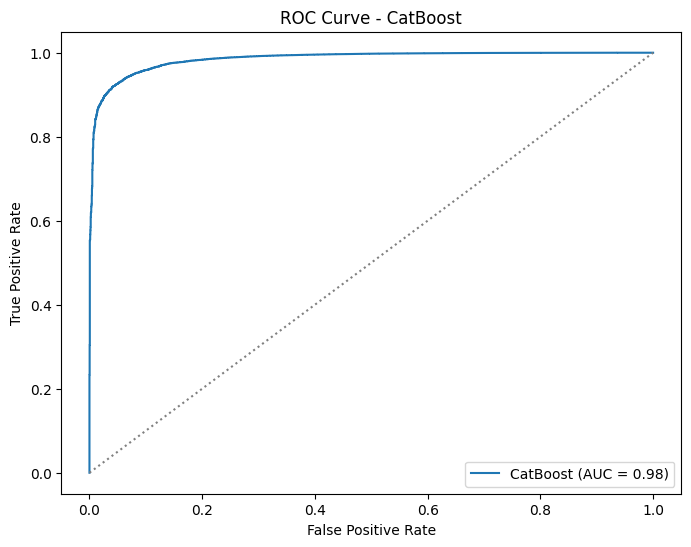
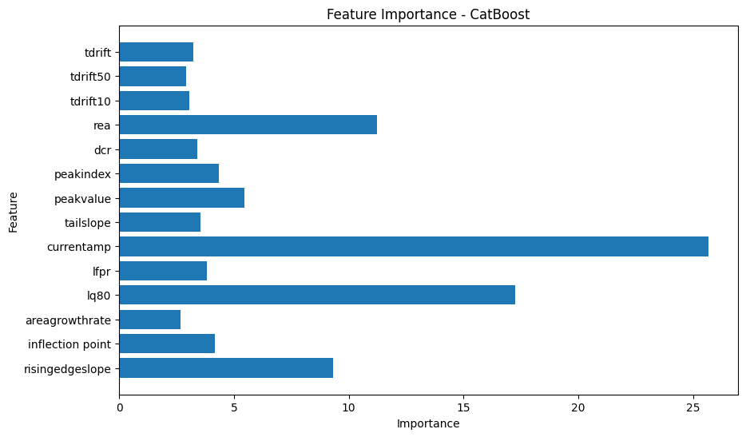
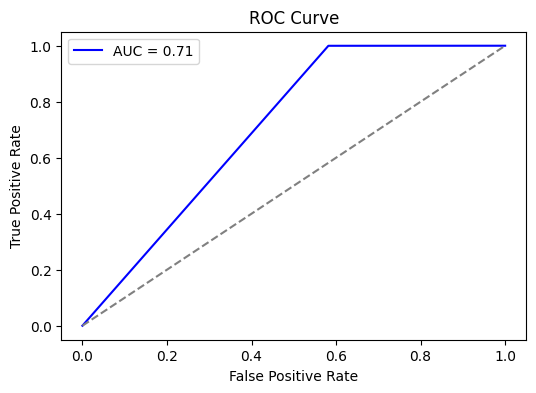
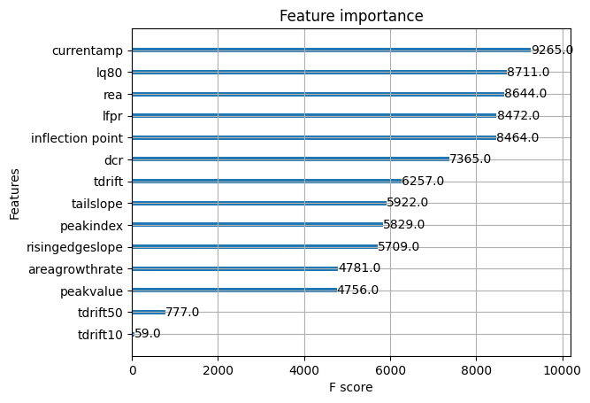
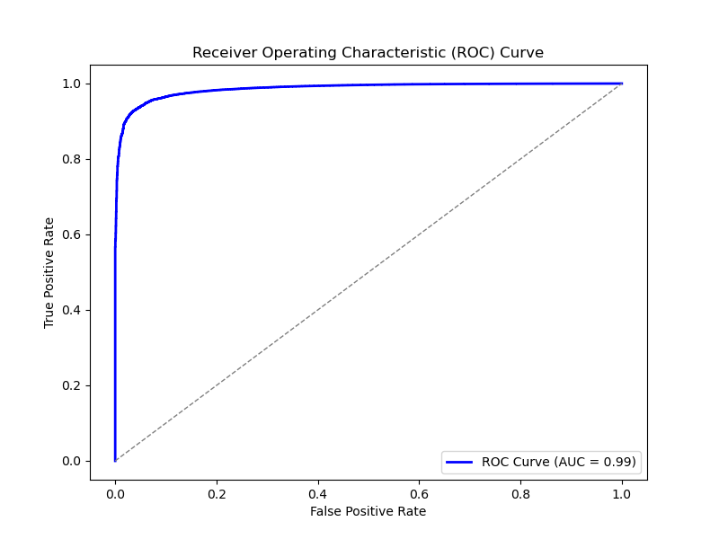
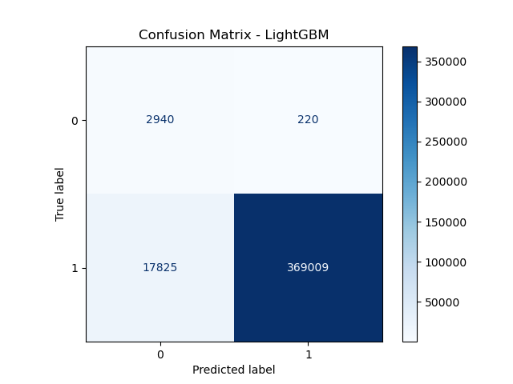
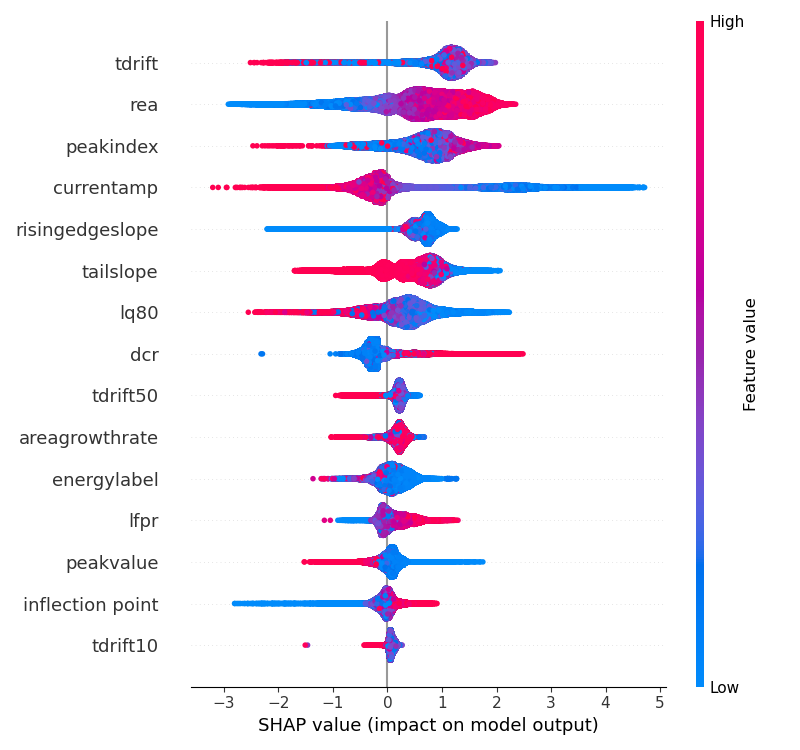
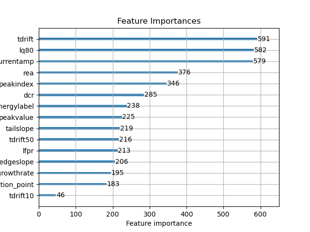

# Methods
### We preprocess waveform data, extract key features, balance classes, train multiple ML models, and evaluate performance.

## Catboost

The CatBoost model was trained to classify the high_avse label using processed data.
Since approximately 98% of the data was labeled as true for high_avse, SMOTE was applied
to balance the dataset by generating synthetic samples for the minority class. The default
model configuration achieved an accuracy of 96.5%. To improve performance, hyperparameter
tuning was performed using RandomizedSearchCV, along with feature importance analysis and
cross-validation to check for overfitting. These optimizations increased the model's accuracy
to 99.4%.

 

## XGBoost

For XGBoost, the model was trained to classify our truedcr label using the our processed data. Imbalanced learning techniques were applied using SMOTE and oversampled from the False class allowing for a balanced dataset to train on. The model had a 94% accuracy as a baseline for the testing data. After that autotuners were used to find the optimal hyperparameters and improved the overall accuracy to 97%. The features that had the most impact were seen to be the current amplitude and the late charge 80.

 

## LightGBM

A LightGBM model was developed to classify lowavse label using the processed data, effectively addressing the dataset's high dimensionality and class imbalance. The Synthetic Minority Over-sampling Technique (SMOTE) was applied to balance the classes, enabling the model to better capture the characteristics of the minority class. Hyperparameter tuning with RandomizedSearchCV was conducted, optimizing key parameters such as num_leaves, min_child_samples, and colsample_bytree to further enhance model performance.

 

Feature importance analysis identified tdrift, lq80, and currentamp as highly influential, consistent with their physical significance related to energy deposition and detector response. The ROC curve underscored the model's strong predictive ability, reflected by an AUC of 0.99. Additionally, SHAP values confirmed that tdrift and lq80 predominantly influenced predictions, providing interpretability regarding feature contributions. The confusion matrix confirmed the model's high accuracy of approximately 97%, indicating minimal misclassification rates.

 

## Random Forest

For the random forest model, the processed dataset was used. This dataset had the specific features that were extracted using the parameter extraction script. The random forest was used to classify the lq label. Similar to the other models, the imblearn distribution was used to create an equal balance of data that was true and false. The model went through multiple iterations and hyperparameter tuning to better its performance.

 

