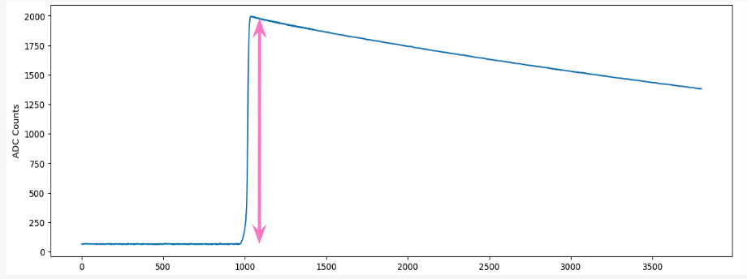
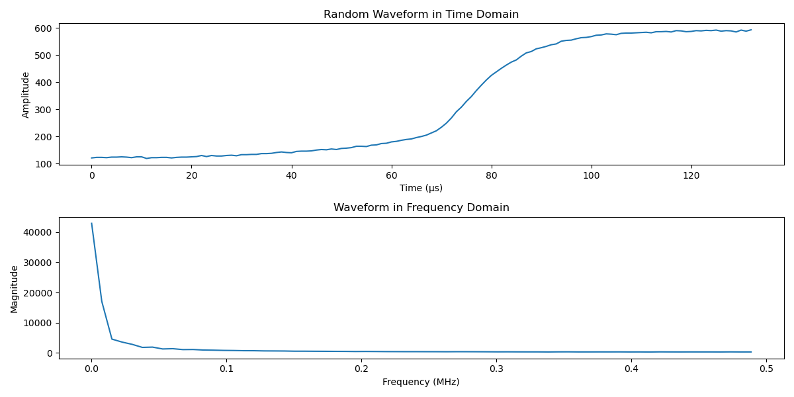

# Parameters

## Drift Time
The drift time (tdrift) is defined as the time taken from the initiation of charge generation to the collection at the detector's point contact. This drift time correlates with the location of the event inside the detector, as interactions that occur further from the point contact result in longer drift times due to the greater distance the charge must travel.
<figure>
    
    <figcaption style="text-align: center;">Figure 1: A plot illustrating tdrift thresholds</figcaption>
</figure>

## Late Charge (lq80)
The LQ80 Parameter is used to measure the amount of energy being collected after 80% of the peak. This is important because multi-site events have extra energy collections that appear in this LQ80 region.
<figure>
    
    <figcaption style="text-align: center;">Figure 2: A plot depicting the LQ80 region</figcaption>
</figure>

## Late Charge Slope (Area Growth Rate)
The Area Growth rate was a way to measure the ability of method was a measure of the growth rate of the wave form past 80% of the peak energy.
<figure>
    
    <figcaption style="text-align: center;">Figure 3: A plot showing the Area Growth Rate</figcaption>
</figure>

## Second derivative Inflection Points 
The inflection points were a way to see how many times our waveform changed from increasing to decreasing and this is important because mutlisite events have much more inflection points than a single site event would have.

## Rising Edge Slope
The Rising Edge slope parameter is a way for us to measure the slope of the charge that was recorded. 
<figure>
     
    <figcaption style="text-align: center;">Figure 4: A plot showing the Rising Edge Slope region</figcaption>
</figure>

## Rising Edge Asymmetry 
The rising edge asymmetry parameter describes how tilted in a direction the rising edge of the signal is, or in other words how skewed the rising edge is. This is important because it can help distinguish between MSE and SSE. MSE will usually have a lower skew meaning it is more symmetrical compared to SSE. 
<figure>
     
    <figcaption style="text-align: center;">Figure 5: This rising edge is a single site event with a REA of 1.316147266130899</figcaption>
</figure>
<figure>
     
    <figcaption style="text-align: center;">Figure 6: Comparatively this rising edge is a multi-site event and has a REA of 0.7821869431061642</figcaption>
</figure>

## Current Amplitude
The current amplitude of a single waveform is the peak rate of charge collection, defined as I = dq/dt which means current amplitude is the derivative of charge. The reason we need that parameter is it helps distinguish between different types of events such as SSE and MSE in our particle detection project, where SSE typically shows a higher amplitude as opposed to MSE.

## Energy Peak 
After the particle hits the detector, the energy reaches its peak. A dramatic spike is visible in the energy graph. This is typically the maximum ADC count. The height of this peak correlates with the energy deposited by the particle in the detector, which is why it's used as a measure of the particle’s energy.
<figure>
     
    <figcaption style="text-align: center;">Figure 7: A plot showing the height of a waveform’s ADC count</figcaption>
</figure>

## Tail Slope 
The tail slope is the rate of charge collection over the length of the waveform’s tail. It indicates how quickly charge dissipates in the detector after the initial interaction.
<figure>
     
    <figcaption style="text-align: center;">Figure 8: The highlighted section is a fragment of the tail</figcaption>
</figure>

## Delayed Charge Recovery 
The DCR parameter helps to distinguish surface alpha background events by assessing the rate of area growth in the tail slope region. It quantifies the arrival of charges that are delayed by one nanosecond or more after the initial charge collection.
<figure>
    
    <figcaption style="text-align: center;">Figure 9: A plot showing the DCR region of a random waveform</figcaption>
</figure>

## Fourier Transform and Low Frequency Power Ratio 
The Fourier Transform is a mathematical operation that transforms a time-domain signal into its frequency-domain representation. It decomposes a complex signal into a sum of sines and cosine components at different frequencies. Fourier Transform is useful for distinguishing between single-site events (SSE) and multi-site events (MSE) within detector data because of the nature of charge distribution within the detector, as most of the energy from the particle interaction in SSE is deposited at a single point whereas it is deposited in multiple locations in MSE.
<figure>
    
    <figcaption style="text-align: center;">Figure 10: A plot showing the Fourier Transformation</figcaption>
</figure>

